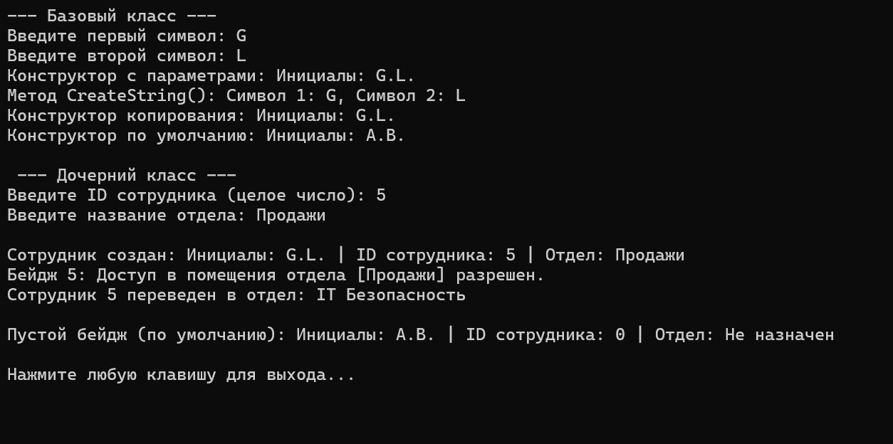
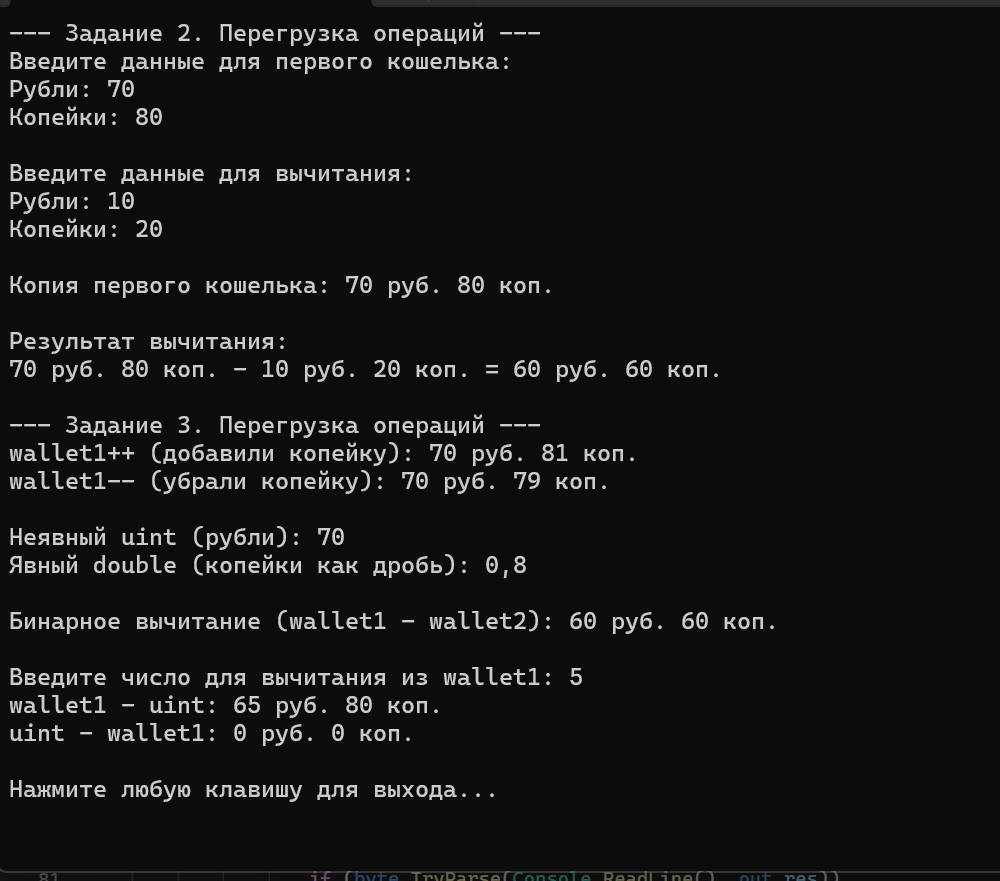

# Раимов Данил КМБ2 Лабораторная №6

# Задание 1. ООП

## Задача 8

### Текст задачи

Разработать класс с двумя символьными полями. Создать конструктор копирования. Разработать
метод, создающий строки из полей. Перегрузить метод ToString() для формирования строки из
полей класса. Реализовать дочерний класс (его содержание предложить самостоятельно и
описать в решении: какой содержательный смысл имеют поля; реализовать конструкторы;
предложить и реализовать 2-3 метода). Протестировать все конструкторы и другие методы
базового и дочернего классов.

### Алгоритм решения

1. Создание базового класса Initials:

Объявление двух полей _firstChar и _secondChar типа char.

Реализация свойств FirstChar и SecondChar для доступа к полям.

Описание трех конструкторов: по умолчанию, с параметрами и конструктора копирования.

Разработка метода CreateString() для объединения полей в строку и переопределение метода ToString() для форматированного вывода объекта.

2. Создание дочернего класса EmployeeBadge:

Наследование от класса Initials. Содержательный смысл: бейдж сотрудника содержит инициалы (наследуются), а также уникальные атрибуты.

Добавление новых приватных полей: _employeeId (номер сотрудника) и _department (название отдела), а также свойств для них.

Реализация конструкторов дочернего класса с передачей инициализации родительских полей базовому классу через ключевое слово base.

Реализация уникальных методов: PrintAccessLevel() (вывод прав доступа) и ChangeDepartment() (смена отдела).

Переопределение метода ToString() с дополнением результата вызова base.ToString().

3. Организация ввода-вывода (класс Program):

Реализация статических методов InputChar, InputInt и InputString.

Использование цикла do-while и метода TryParse для обработки некорректного ввода без прерывания работы программы.

Добавление проверок: метод InputChar принимает только буквы (char.IsLetter), а метод InputString блокирует ввод цифр через посимвольный перебор циклом foreach.

### Тестирование

# Задание 2. Перегрузка операций и Задание 3. Перегрузка операций

## Задача 8

### Текст задачи

В задании 2 необходимо реализовать определение класса (поля, свойства, конструкторы, перегрузка
метода ToString() для вывода полей, заданный метод согласно варианту). Протестировать все
методы, включая конструкторы (при тестировании методов классов в заданиях не забывайте
проверять вводимые пользователем данные на корректность).
В задании 3 добавить к реализованному в задании 2 классу указанные в варианте перегруженные
операции. Протестировать все методы.

### Алгоритм решения

Часть 1. Реализация Задания 2

Определение полей и свойств: * Созданы приватные поля _rubles и _kopeks.

Написаны полные свойства. В set свойства Kopeks есть логика переполнения: если значение >= 100, вычисляется целая часть (добавляется к рублям), а остаток от деления на 100 записывается в копейки.

Инициализация: Написаны три конструктора. Конструктор с параметрами использует свойство Kopeks для автоматической проверки вводимых данных.

Метод вычитания Subtract: Суммы обоих объектов переводятся в наименьшую единицу измерения — копейки (используется тип long для предотвращения переполнения).Выполняется вычитание. Если разность < 0, возвращается новый нулевой объект Money(0, 0).В противном случае результат конвертируется обратно в рубли и копейки.

Вывод данных: Метод ToString() переопределен для вывода в формате «X руб. Y коп.».

Часть 2. Реализация Задания 3

Унарные операции: 

Оператор ++: возвращает новый объект с увеличенным на 1 значением копеек (при достижении 100 копеек происходит автоматически в конструкторе).

Оператор --: проверяет баланс на равенство нулю. Если копеек 0, "занимает" 1 рубль (рубли -1, копейки = 99). Иначе просто вычитает 1 копейку.

Приведение типов:

Неявное (implicit) к uint: возвращает только поле Rubles.

Явное (explicit) к double: возвращает поле Kopeks, разделенное на 100.0 (результат строго < 1).

Бинарные операции (вычитание):

Объект из объекта (Money - Money): дает выполнение уже написанному методу Subtract.

Число из объекта (Money - uint) и объект из числа (uint - Money): оба операнда переводятся в общую сумму копеек, вычисляется разность. Если результат отрицательный, возвращается 0, иначе формируется новый объект Money.

Часть 3. Ввод данных и тестирование (Класс Program)

Для корректного ввода реализованы методы ReadUint и ReadByte. Они используют цикл while(true) и метод TryParse, запрашивая данные у пользователя до тех пор, пока ввод не станет корректным.

В методе Main происходит последовательное создание объектов, вызов метода вычитания из Задания 2, а затем поочередное тестирование всех унарных, бинарных операций и приведений типов из Задания 3 с выводом результатов в консоль.

### Тестирование

